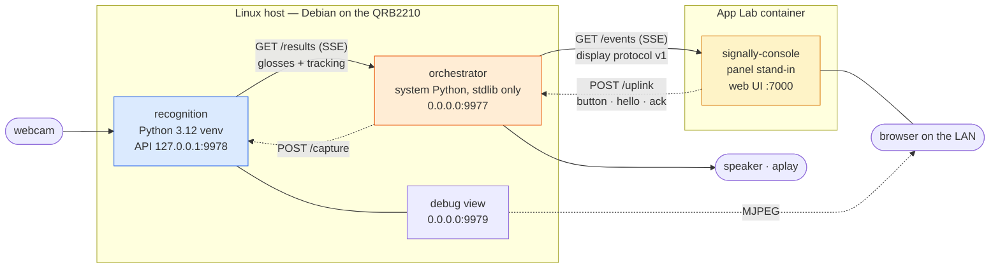

# SignAlly

A ISL (Indian Sign Language) -> text bridge for the Arduino UNO Q. A
camera watches someone sign; the device shows the phrase on
a panel. the recognition
service, the orchestrator that turns glosses into sentance and display messages,
the panel firmware, the App Lab console, and the script that starts it all.


## Layout

| | What |
|---|---|
| `orchestrator/` | Device state, gloss → phrase, audio, and the display JSON protocol. Stdlib only, Python ≥3.11 |
| `recognition/` | Camera in, glosses out over HTTP. MediaPipe + torch via [`islkit`](https://github.com/jbrathwa/islkit), Python 3.12 exactly |
| `applab/signally-console/` | App Lab app: mirrors the protocol stream in a browser and forwards it to the panel. `sketch/` is the STM32 relay that carries lines between the Bridge and the panel's UART — it lives inside the app because App Lab flashes a sketch only from `<app>/sketch/sketch.ino` |
| `panel/` | CrowPanel 2.8" ESP32 display firmware. PlatformIO, LVGL v8. Renders the display protocol and acks it — see [the panel doc](docs/panel.md) |
| `mcu/uno_q_mcu_uart_test/` | Bench harness: a mock state machine that drives the panel from typed commands with no stack running. Flashing it replaces the relay, so only one of the two is on the STM32 at a time |
| `scripts/signally-start.sh` | Start, stop and inspect all three processes on the board |
| `phrases.json` | The gloss → English + wav table the orchestrator is keyed on. 17 glosses |
| `docs/` | [Architecture](docs/architecture.md), the [orchestrator](docs/orchestrator.md), the [display protocol](docs/display-protocol.md), the [panel](docs/panel.md), and the [recognition service API](docs/recognition-service-api.md) |



Two projects, deliberately separate: **they cannot share a Python.**
mediapipe 0.10.18 builds cp39–cp312 only, and that version is itself forced by
the board's Cortex-A53 lacking ARMv8.1-A LSE atomics — there is no upgrade path
on this hardware. [`docs/architecture.md`](docs/architecture.md) draws the split,
the ports, and what happens when each process dies.

## Install and run

### `orchestrator/`

Standard library only — no venv and nothing to install, including on the board's
system Python. The package is not installed, so `src` has to be on the path, and
`--phrases` and `--audio-dir` default to paths relative to the working directory.
Run from `orchestrator/`; `phrases.json` lives one level up, at the repo root, so
point `--phrases` at it explicitly:

```bash
cd orchestrator
PYTHONPATH=src python3 -m orchestrator --phrases ../phrases.json       # 0.0.0.0:9977, upstream 127.0.0.1:9978
PYTHONPATH=src python3 -m orchestrator --phrases ../phrases.json --log-level DEBUG
PYTHONPATH=src python3 -m orchestrator --help
```

| Route | Who calls it | Body |
|---|---|---|
| `GET /ping` | the console, probing for the host | `{"ok":true}` |
| `GET /events` | the console | SSE; each `data:` is one protocol JSON object |
| `POST /uplink` | the console | one protocol JSON object — the panel's `button`, `hello`, `ack` |
| `GET /health` | you | whether recognition is connected, and everything else |

It binds `0.0.0.0` deliberately: the App Lab container reaches it across the
docker gateway, so loopback-only would break the display chain.

### `recognition/`

Three things it needs that a fresh checkout does not give you: Python 3.12,
`islkit`, and a classifier checkpoint.

```bash
cd recognition
python3.12 -m venv .venv
.venv/bin/pip install islkit                       # landmark encoder, model and inference
.venv/bin/pip install -e ".[dev]"                  # the service itself
.venv/bin/python -m recognition --help
.venv/bin/python -m recognition --camera 2         # needs a camera
```

Make the venv with `python3.12 -m venv`, not `uv venv` — a `uv venv` ships no
`pip`, so the two install lines above have nothing to run.

`islkit` is the open-source landmark encoder, model and inference package.

**The checkpoint is not in this repository.** Copy `classifier_262.pt` and its label map
`labels_262.json` into the same directory — the service refuses to start without
them, and refuses if the two disagree about the class count:

```bash
mkdir -p ~/models && cp /path/to/classifier_262.pt /path/to/labels_262.json ~/models/
```

`~/models/classifier_262.pt` is the default; `--classifier` or
`$RECOGNITION_CLASSIFIER` override it. On the board, `islkit` installs from PyPI the
same way. Full install, run and consume guide, board included:
[`docs/recognition-service-api.md`](docs/recognition-service-api.md).

## The whole stack on the board

```bash
scripts/signally-start.sh start      # probes for a working camera, starts all three, prints status
scripts/signally-start.sh status     # the answer to "are all three running?"
scripts/signally-start.sh stop
scripts/signally-start.sh restart
scripts/signally-start.sh logs [recognition|orchestrator|console]
```

`status` is the point of the script: it verifies each process **by port and by
`/health`**, never by an exit code, and reports the console app's App Lab state
alongside. Treat "are all three running?" as something checked, not assumed.

It also turns the annotated MJPEG **debug view** on by default
(`VIEW_PORT=9979`), at `http://<board>:9979/view`. That port binds `0.0.0.0`, so
anyone who can reach the board on the network can watch the camera. It is
deliberate — it is how you see what the model sees from a laptop — but set
`VIEW_PORT=0` before starting to turn it off. The recognition API itself stays on
loopback, so nothing off the board can start the camera.

The three-process stack has run on this board, but **not since the code moved
into this repo**: the start script's paths all changed in the move and have not
been exercised on hardware since.

## Tests

Each project separately, from its own directory. `recognition/` uses its venv's
interpreter.

```bash
cd orchestrator && PYTHONPATH=src python3 -m pytest -q   # 128 passed
cd recognition  && .venv/bin/python -m pytest -q    # 100 passed
```

Everything runs with no board, no camera and no sound, against the recorded
fixtures in `orchestrator/tests/fixtures/` and an in-process fake recognition
server.

## Known limits

- **It makes no sound on the UNO Q.** The board has no reachable audio output.
  The path is built and tested; the
  wav files do not exist yet. Missing files are logged and skipped.
- **The glosses are wrong on your own signing, and that is expected.** The head
  is still the pretrained 262-class one. Use the stream to check plumbing, never
  as an accuracy signal.
- **The vocabulary is not reconciled.** `phrases.json` holds 17 glosses against a
  262-class head. A recognised sign with no phrase row comes out as `unclear`.
- **Two definition-of-done items are unverified** — `/ping` answering from
  inside an App Lab container, and `stop` halting capture in the *live*
  recognition service.
- **The English phrase strings are a first draft** and need review by whoever
  owns the ISL vocabulary. `you`, `friend`, `mother` and `alright` are the
  doubtful ones.
- **`tracking: ok` re-emitting state** is an orchestrator-side recovery the
  protocol spec does not describe. It uses only v1 messages, but the panel has
  never been tested against it.
- **It is unauthenticated and binds `0.0.0.0`.** Anyone on the same LAN can
  `POST /uplink` to start or stop the camera and mute the device, and can `GET
  /events` to read a live transcript of what a Deaf user is signing. The bind
  is required — the App Lab container reaches it across the docker gateway —
  and for a hackathon device on a trusted network this is an accepted risk, not
  an oversight. Off that network, bind the docker bridge address instead of
  `0.0.0.0`, or put a shared-secret header on `/uplink`; the header needs a
  matching change in the console.
