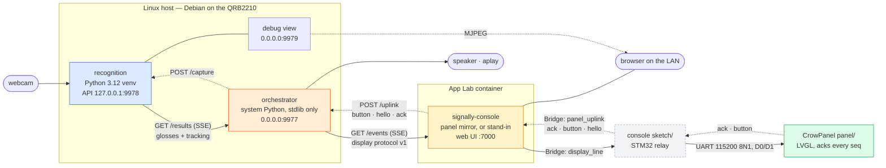
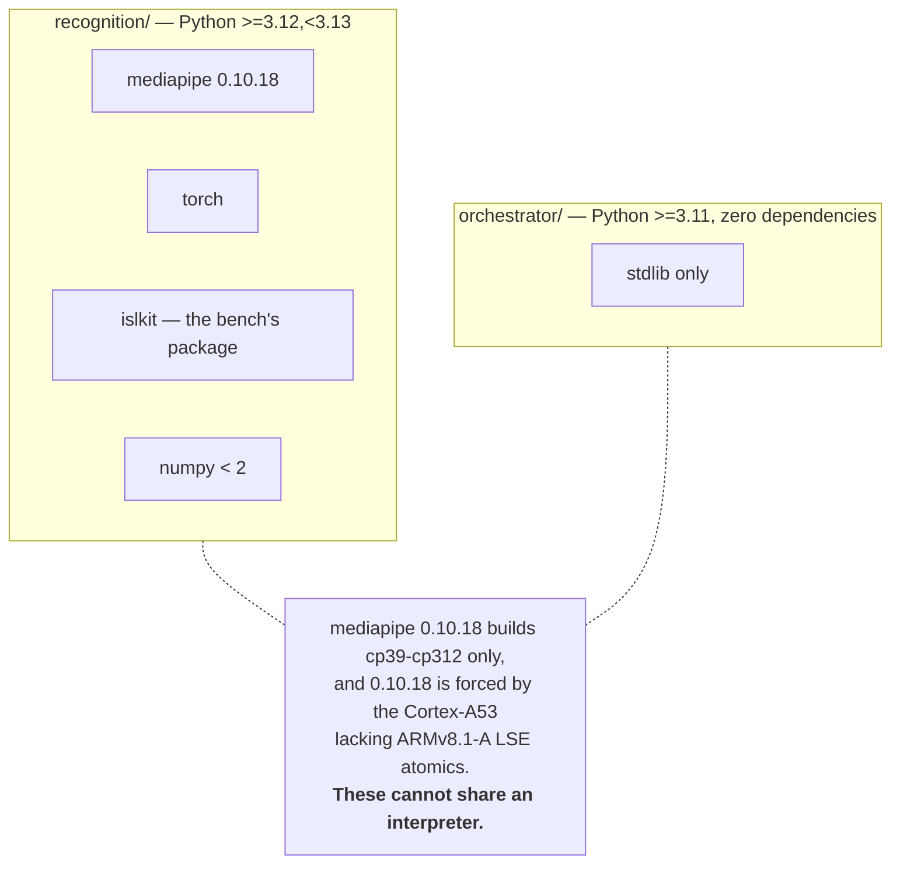
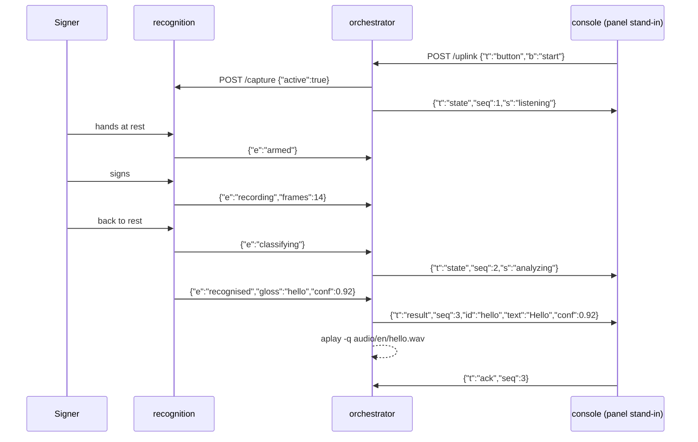

# SignAlly — device architecture

How the device is put together, why it is three processes and not one, and what
happens when each piece dies.

For the recognition service's own API — every route, event, field and flag —
see [`recognition-service-api.md`](recognition-service-api.md). This document is
about the shape of the whole thing.

---

## 1. The runtime stack

Three processes on demo day, plus the camera and the speaker. Two of them are
plain Python on the board's Linux side; the third runs in an App Lab container
and is the only one that talks to a browser.

**The panel is wired in, and the chain runs end to end.** Verified on hardware
on 2026-09-07: a `button start` on `/uplink` reached the CrowPanel as
`{"t":"state","seq":4,"s":"listening"}` about 100 ms later and came back acked,
as did an `error` ("Move back"), the `state` re-send that clears the error
screen, and the `idle` on stop. `/health` showed `unknown: 0`, `unmatched_acks:
0`, `dropped: 0` — every `seq` emitted was acked by the panel itself and matched.
`result` and `unclear` have not yet been driven by a real gesture on hardware;
both parse and ack correctly (see section 5). Its firmware lives in
[`panel/`](../panel/) and implements the display protocol in full -- `idle`,
`listening`, `analyzing`, `result`, `unclear` and `error` all render and all ack.
[`applab/signally-console/sketch/`](../applab/signally-console/sketch/) moves
whole lines between the Bridge and the UART, and `signally-console` forwards to
it. The relay lives *inside* the console app because App Lab discovers and
flashes a sketch only at `<app>/sketch/sketch.ino`; a relay kept anywhere else is
never flashed, and the failure is silent — `panel_hello` times out and the
console quietly falls back to standing in. See [`panel.md`](panel.md).

**The console is now a mirror, not a stand-in -- when a panel answers.** On each
reconnect it probes for a relay with `panel_hello`. With one present it forwards
every downlink line and **stops acking**, because the panel is acking for itself;
two components acking one `seq` would report every message as having landed
twice, and would go on saying so after the panel fell silent. With no relay it
behaves exactly as before, acking on the panel's behalf so the orchestrator sees
the traffic it will see from real hardware.

The relay is deliberately witless. It does not parse the protocol, hold state, or
mint `seq` -- it moves lines. Everything that decides anything stays on the Linux
side. The other sketch, [`mcu/uno_q_mcu_uart_test/`](../mcu/uno_q_mcu_uart_test/),
*does* have a mock state machine and is the bench harness for working on the
panel with no stack running; only one of the two can be flashed at a time, and
starting the console app flashes the relay over whatever was there.

### Who owns what

| Process | Owns | Explicitly does not |
|---|---|---|
| `recognition` | The camera, MediaPipe Holistic, the classifier, take segmentation, writing takes to disk | Know what a screen is, what language the device speaks, or how messages are numbered. It emits glosses under the key `e`, never `t` |
| `orchestrator` | Device state, the gloss → phrase table, `seq`, the display protocol, the audio path | Touch the camera, load torch, or parse anything MediaPipe produced. It is stdlib-only and that is why it is trusted with the audio path |
| `signally-console` | The browser page, the ack loop, the buttons | Interpret protocol messages beyond drawing them. It forwards whole lines |

If a change to the display protocol would require touching a file under
`recognition/`, the boundary has been drawn wrong.

### The ports, and which binds where

| Port | Process | Binds | Why |
|---|---|---|---|
| 9978 | recognition API | `127.0.0.1` | Loopback so nothing off the board can start the camera. `/capture` is an unauthenticated switch on a camera pointed at a person |
| 9979 | recognition debug view | `0.0.0.0` | So a laptop on the same network can watch what the model sees. **This is the one surface that is not loopback** — see the warning below |
| 9977 | orchestrator | `0.0.0.0` | The App Lab container reaches it across the docker gateway; loopback would break the display chain entirely |
| 7000 | console web UI | container | The App Lab `web_ui` brick's own port |

> **The debug view is reachable from the network, and on by default.** The
> service's own flag default is off (`--view-port 0`), but
> `scripts/signally-start.sh` sets `VIEW_PORT=9979`. At the script's defaults,
> anyone who can reach the board can watch the camera at
> `http://<board>:9979/view`. Set `VIEW_PORT=0` before starting to turn it off.
> The same accepted-risk note applies to the orchestrator: it is unauthenticated
> on `0.0.0.0`, so anyone on the LAN can `POST /uplink` to start or stop the
> camera, and `GET /events` to read a live transcript of what a Deaf user is
> signing. For a hackathon device on a trusted network this is an accepted risk,
> not an oversight.

---

## 2. Why two projects, not one

The split is not taste. Two dependency sets that cannot occupy the same
interpreter, and a hardware constraint underneath that has no upgrade path.

Read it in the other direction and the benefit is clearer: because the
orchestrator depends on nothing, it runs on the board's system Python with no
venv, and it cannot be broken by a numpy upgrade that uninstalls the landmark
extractor. It is the process that holds device state and drives the audio path,
and it has no way to fail to import.

`islkit` — the feature encoder, the model and the inference code — is developed in
the separate `islkit` project. On a laptop it is an editable install
of a sibling checkout; on the board it is a wheel built on the laptop and copied
across, because that keeps the board free of repository credentials.

---

## 3. One gesture, end to end

The ordering is the content here — in particular, that a take is delimited by a
return to rest, so exactly one prediction is emitted per deliberate gesture.
There is no sliding window and no per-frame classification.

Two things in that trace are worth stating outright.

**Capture starts paused.** The service comes up not capturing, and the
orchestrator ignores every recognition event while `capture_active` is false.
The reason is in the audio arrow: a recognised gloss maps to speech
unconditionally, so a device that captured from boot would talk unbidden.

**`unclear` is a normal outcome, not an error path.** Below the confidence
threshold the orchestrator emits `{"t":"unclear"}` and plays nothing. So does a
`recognised` gloss with no row in `phrases.json` — a bare English gloss on screen
would read as a phrase the device never said. The device is allowed to say *I
don't know*, and it should: a confident wrong answer puts words in a Deaf
person's mouth.

**A result owns the screen for three seconds.** Recognition re-arms the instant a
take closes, so `recognised` is followed by `armed` within milliseconds, and
forwarding both straight through put `state: listening` on the wire in the same
breath as the `result`. The panel clears its label on any non-RESULT state, so
the sentence was wiped under 100 ms later — measured on hardware, every time.
`RESULT_DWELL_S` in `app.py` holds the screen instead, queueing whatever wanted
it. The dwell lives in the orchestrator because it is the only thing that decides
what the display shows, and outside `core` because it needs a clock. Three things
still pre-empt it: a new take (`analyzing`), an explicit stop (`idle`), and a
fault — a stale sentence must never outlive the news that the camera died.

---

## 4. When something dies

Nothing in this stack takes another process down with it. Each row below is
behaviour in the shipped code, not an aspiration.

| What dies | What happens |
|---|---|
| **The camera** (unplugged, or stops returning frames) | recognition emits `fault camera_lost` or `camera_open_failed`, latches `ok:false` in `/health`, disarms the segmenter, and reopens on a 1/2/4/8 s backoff. The process stays up. The orchestrator turns the fault into `{"t":"error"}` on the panel |
| **The classifier or the extractor raises** | `fault model_error`. The clip is kept as evidence, the service continues, and the latch clears on the next good take |
| **recognition** (process exits) | The orchestrator's stream ends; it reconnects on a backoff. After 5 s with no line at all — `: ping` comments count as lines — it emits `{"t":"error","text":"Recognition offline"}` once per outage, not once per check. On reconnect it re-asserts `POST /capture`, because recognition's capture flag does not survive its restart |
| **orchestrator** (process exits) | recognition is undisturbed: it keeps capturing, keeps recording takes, keeps serving `/health`. Capture state is its own, not derived from who is connected. The console loses its SSE stream and retries the host probe every 2 s |
| **console / App Lab** | The orchestrator carries on with zero subscribers. Audio still plays; `subscribers: 0` in `/health` is the tell |
| **The speaker, or a missing wav** | Logged and skipped, counted in `/health` under `audio.skipped` / `audio.failed`. Playback runs on its own thread so a two-second wav cannot stall event handling. **The board has no reachable audio output today**, so silence with a clean log is the expected outcome on hardware |
| **A slow SSE consumer** | recognition drops the oldest event and counts `dropped_events` — the capture thread holds the camera and must never stall. In the orchestrator the rate is about one message per second and `dropped` should always be zero, so a non-zero value there is a defect signal |
| **A fifth SSE subscriber** | `503`. Both hubs cap at four. A closed connection frees its slot within about one heartbeat, not instantly |
| **The disk fills** | Below ~500 MB free, recognition stops writing takes, keeps recognising, and says so in `disk_free_mb` |

`scripts/signally-start.sh status` is the one command that answers "are all three
running?", and it answers it by port and by `/health`, never by an exit code.
The orchestrator's `/health` reports `recognition_connected`, so that single
check covers two of the three processes; the console's liveness shows up as acks
arriving.

---

## 5. What is not verified

- **The three-process stack runs in its current layout.** Exercised on
  `white-witch` on 2026-09-07: `scripts/signally-start.sh start` brought up
  recognition (camera probed to `/dev/video0`), the orchestrator, and the console
  app, which compiled and flashed the relay and then reported
  `panel relay present: relay-0.1.0`.
- **`result` and `unclear` now render from a real gesture**, verified on hardware
  2026-09-07 with the 17-class head: `hospital` at 0.9995 and `goodafternoon` at
  0.9929 reached the panel and held the screen for the full dwell. They are also
  proven at the parser: all 28 lines the orchestrator can emit — every
  `phrases.json` row, every screen, every error text, and the 120-char `cap_text`
  boundary — were run through the panel's own `uart_receiver.h` compiled on a
  host, and all 28 parsed and acked with the longest at 153 bytes against the
  256-byte cap.
- **Tracking still flaps**, and nothing damps it yet. One 68 s hardware run
  produced 39 messages, most of them `Move back` alternating with `listening` as
  the signer drifted in and out of frame. The result dwell queues that chatter
  rather than letting it wipe a sentence, so it is cosmetic now rather than
  destructive — but the screen still churns between signs.
- **No sustained fps figure is written down** for any given
  checkpoint / resolution / `--model-complexity` combination. Read it from
  `/health` on each deployment rather than trusting a number quoted anywhere.
- **The recognised glosses are wrong on your own signing, and that is expected.**
  The head is still the pretrained 262-class one. Use the stream to verify
  plumbing, never as an accuracy signal.
- **The vocabulary is not reconciled.** `phrases.json` holds 17 glosses; the
  recognition head knows 262. A recognised sign with no phrase row comes out as
  `unclear`.
