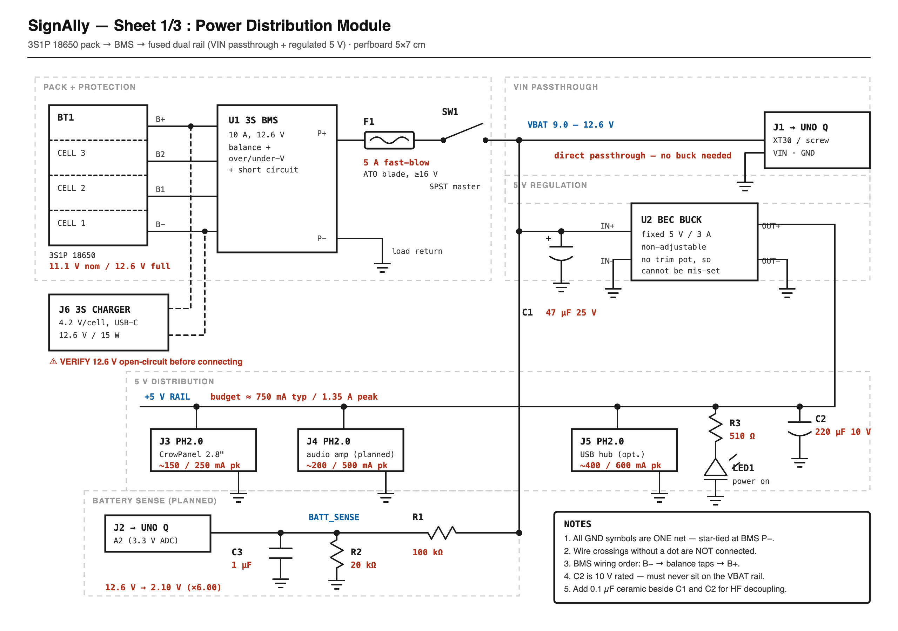
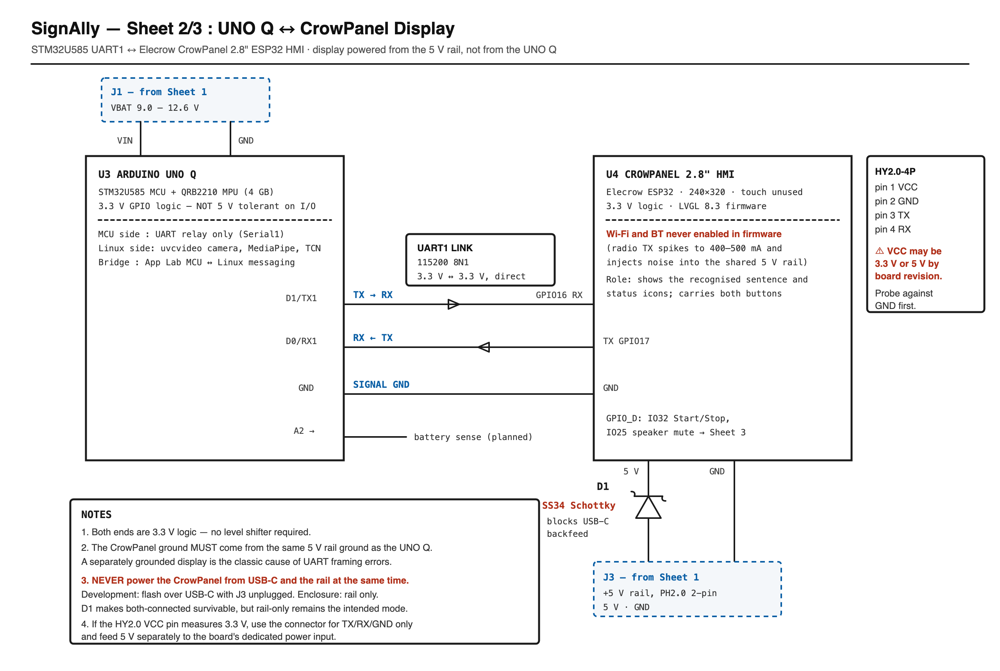
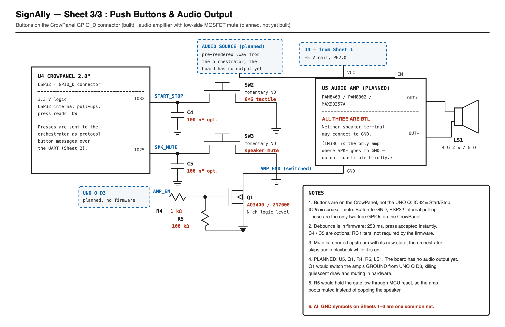

# Hardware

The device's electrical design: battery power, the UNO Q ↔ CrowPanel link, the buttons, and the
planned audio output. Three schematic sheets live in [`schematics/`](../schematics/), each as an
editable SVG and a PNG.

For how the software on this hardware fits together, see [`architecture.md`](architecture.md); for
the panel firmware and its wiring bring-up, see [`panel.md`](panel.md).

---

## 1. The sheets

| Sheet | Covers |
|---|---|
| [1/3 Power](../schematics/signally-sheet1-power.png) ([SVG](../schematics/signally-sheet1-power.svg)) | 3S pack → BMS → fuse → master switch, VBAT passthrough to the UNO Q, regulated 5 V rail and its taps, planned battery sense |
| [2/3 Display](../schematics/signally-sheet2-display.png) ([SVG](../schematics/signally-sheet2-display.svg)) | UNO Q ↔ CrowPanel UART, and how the panel is powered |
| [3/3 Buttons & audio](../schematics/signally-sheet3-buttons.png) ([SVG](../schematics/signally-sheet3-buttons.svg)) | The two push buttons on the CrowPanel, and the planned amplifier with hardware mute |

Connector designators carry across sheets: J1, J3 and J4 on sheets 2 and 3 are the connectors
drawn on sheet 1.







## 2. Built and planned

| Part of the design | Status |
|---|---|
| 3S pack, BMS, fuse, master switch, 5 V buck, power LED | Built |
| UNO Q Serial1 (D0/D1) ↔ CrowPanel UART1 (GPIO17/GPIO16), 115200 8N1 | Built; used by the display protocol |
| CrowPanel powered from the 5 V rail through D1 | Built |
| Start/Stop and speaker-mute buttons on the CrowPanel (IO32 / IO25) | Built; read by the panel firmware |
| C4 / C5 debounce capacitors | Optional; the firmware debounces in software |
| Battery sense divider to UNO Q A2 | **Planned**: no firmware reads A2 yet, so the battery icon is not live |
| Audio amplifier U5, speaker LS1, hardware mute Q1 driven from UNO Q D3 | **Planned**: the UNO Q has no reachable audio output yet |
| Touch on the CrowPanel | Present on the board, not used by the firmware |

## 3. Net list

### Sheet 1 — power

```
VBAT        BT1(B+) — U1(B+) ; U1(P+) — F1 — SW1 — J1.1 (UNO Q VIN)
                                            — C1(+) — U2(IN+)
                                            — R1                      [planned sense]
+5V         U2(OUT+) — C2(+) — R3 — J3.1 — J4.1 — J5.1
BATT_SENSE  R1 — R2 — C3 — J2.1 (UNO Q A2)                           [planned]
GND         U1(P−) — C1(−) — C2(−) — C3 — R2 — LED1(K) — U2(IN−/OUT−)
            — J1.2 — J2.2 — J3.2 — J4.2 — J5.2
BALANCE     BT1(B1) — U1(B1) ; BT1(B2) — U1(B2)
CHARGE      J6(+) — U1(B+) ; J6(−) — U1(B−)
```

The divider scales a full pack to the ADC range: `12.6 V × 20 kΩ / (100 kΩ + 20 kΩ) = 2.10 V`, a
factor of **×6.00**. At the BMS undervoltage cutoff (about 9.0 V) the ADC would see 1.50 V, inside
the 3.3 V range across the whole discharge curve.

### Sheet 2 — display

```
UART_TX     U3(D1 / Serial1 TX) — U4(GPIO16, UART1 RX)
UART_RX     U3(D0 / Serial1 RX) — U4(GPIO17, UART1 TX)
GND         U3(GND) — U4(GND) — J3.2
+5V_DISP    J3.1 — D1(A) ; D1(K) — U4(5V)
```

### Sheet 3 — buttons and audio

```
START_STOP  U4(IO32) — SW2 — GND ; C4 across SW2 (optional)
SPK_MUTE    U4(IO25) — SW3 — GND ; C5 across SW3 (optional)
AMP_EN      U3(D3) — R4 — Q1(G) ; R5 Q1(G)–Q1(S)                 [planned]
AMP_GND     U5(GND) — Q1(D)          switched, not tied to GND   [planned]
GND         Q1(S) — GND
SPK         U5(OUT+) — LS1(+) ; U5(OUT−) — LS1(−)   bridge-tied: neither side to GND
```

The buttons use the ESP32's internal pull-ups, so a press reads LOW. IO32 and IO25 are the only
user-available pins on the CrowPanel's `GPIO_D` connector; everything else is committed to the
display, touch, SD slot, I²C, UART and boot button.

## 4. Bill of materials

### Power module

| Ref | Part | Notes |
|---|---|---|
| BT1 | 3S1P 18650 pack | 11.1 V nominal, 12.6 V full |
| U1 | 3S BMS, 10 A | Balance, over/undervoltage and short-circuit protection |
| U2 | Buck (BEC) module, fixed 5 V 3 A | Non-adjustable, so it cannot be mis-set |
| F1 | 5 A fast-blow blade fuse (ATO/ATC) | ≥16 V rated, inline holder on P+ |
| SW1 | SPST rocker | Master power cut |
| C1 | 47 µF 25 V electrolytic | Buck input |
| C2 | 220 µF 10 V electrolytic | 5 V output. Never on the VBAT rail |
| C3 | 1 µF ceramic | ADC filter (planned) |
| R1 / R2 | 100 kΩ / 20 kΩ, ¼ W | Battery sense divider (planned) |
| R3 | 510 Ω ¼ W | LED series resistor |
| LED1 | 3 mm LED | Power-on indicator |
| J1 | XT30 or screw terminal | VBAT to UNO Q VIN |
| J2–J5 | PH2.0 2-pin | Battery sense, and three 5 V taps |
| J6 | 3S CC/CV charger, USB-C, 15 W | 4.2 V per cell |
| — | 5 × 7 cm perfboard | Point-to-point wiring |

### Display, controls and audio

| Ref | Part | Notes |
|---|---|---|
| U3 | Arduino UNO Q, 4 GB | STM32U585 MCU + QRB2210 MPU |
| U4 | Elecrow CrowPanel 2.8" ESP32 HMI | Wi-Fi and Bluetooth never enabled by the firmware |
| D1 | SS34 Schottky | Panel supply; blocks backfeed from the panel's USB-C |
| SW2 | 6 × 6 mm tactile, momentary NO | Start/Stop |
| SW3 | 6 × 6 mm tactile, momentary NO | Speaker mute |
| C4, C5 | 100 nF ceramic | Optional button filtering |
| U5 | PAM8403, PAM8302 or MAX98357A | Planned. All bridge-tied (BTL) |
| LS1 | 4 Ω 2 W or 8 Ω speaker | Planned |
| Q1 | AO3400 or 2N7000, N-channel logic level | Planned hardware mute |
| R4 / R5 | 1 kΩ / 100 kΩ | Planned gate resistor / gate pull-down |

**5 V rail budget:** about 750 mA typical and 1.35 A peak, including the planned amplifier and an
optional USB hub, against a 3 A converter.

## 5. Before powering up

Four values on these sheets come from datasheets and board listings, not from a meter. Check each
before trusting the drawing.

- [ ] **Charger open-circuit voltage.** Meter J6 unloaded. It must read 12.6 V; a 14.2 V lead-acid
  style charger would overcharge every cell.
- [ ] **CrowPanel HY2.0-4P VCC pin.** It is 3.3 V or 5 V depending on board revision. With the panel
  on USB-C alone, probe each pin against GND. If VCC is 3.3 V, use the connector for TX/RX/GND only
  and feed 5 V to the board's dedicated power input.
- [ ] **Never power the CrowPanel from USB-C and the rail at once.** Flash over USB-C with J3
  unplugged; run from the rail in the enclosure. D1 makes both-connected survivable, not intended.
- [ ] **Divider factor** (once battery sense is implemented). Read A2 at a known pack voltage and
  confirm ×6.00 against a meter rather than trusting resistor tolerance.

## 6. Drawing conventions

- Every GND symbol on all three sheets is **one net**, star-tied at the BMS P− terminal.
- Wire crossings without a junction dot are **not** connected.
- Both ends of the UART are 3.3 V logic, so no level shifter is needed. The panel's ground must come
  from the same rail ground as the UNO Q; a separately grounded display is the classic cause of UART
  framing errors.
- The bridge-tied amplifiers must never have a speaker terminal tied to GND. An LM386, where SPK−
  does go to ground, is not a drop-in substitute.
