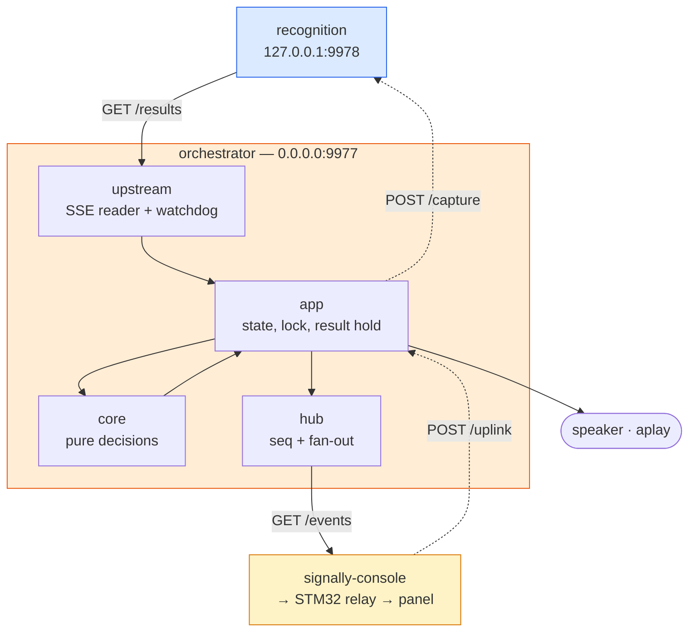

# The orchestrator

The device's decision-maker. Recognition says *"that was `hello`, 0.92"*; everything after that
is here: what those words are in English, which `.wav` to play, what number the message carries,
what state the device is in, and what to do when a button press comes back.

It is the **only** process that speaks the [display protocol](display-protocol.md), and the only
one that knows the device has a screen, a speaker, or a vocabulary.

Code: [`orchestrator/`](../orchestrator/). For where it sits in the whole stack and what happens
when each process dies, see [`architecture.md`](architecture.md).

---

## 1. What it owns, and what it must not



**It owns:**

- **Device state.** Which screen is showing, whether capture is on, the mute gate, the last
  tracking status, and whether recognition is offline. Recognition *executes* capture; the
  orchestrator *decides* it.
- **The `seq` counter.** One monotonic integer, stamped on every outbound message except `hello`,
  reset only when the process restarts.
- **The phrase table.** `phrases.json`, keyed by the gloss the model emits.
- **The audio path.** Pre-rendered `.wav` files, played with `aplay`.

**It must not own:**

- **The camera, MediaPipe, or the model.** One process holds the camera, and it is recognition.
- **Screen ids, image indices, or LVGL.** It emits `id` and `text`; how the panel draws them is the
  panel's business.
- **Render timing, except the result hold.** `analyzing` is emitted when inference starts, not
  padded to look slower. The one deliberate hold is described in
  [section 6](#6-the-result-hold).

**It has no dependencies.** Standard library only: `http.server`, `json`, `urllib`, `threading`,
`subprocess`. That is why it runs on the board's system Python with no virtualenv, and why it is
trusted with the audio path: nothing a numpy or torch upgrade does can break its imports.

### Module layout

| Module | Job |
|---|---|
| `core.py` | Every decision, as pure functions of one event and the current `DeviceState`. No sockets, no clock, no counter |
| `app.py` | Holds the state and the lock, turns `core` outcomes into publishes and audio calls, owns the result hold and ack matching, builds `/health` |
| `hub.py` | Stamps `seq`, keeps the last `state` message, fans messages out to `/events` subscribers |
| `upstream.py` | Reads recognition's SSE stream, runs the offline watchdog, sends `POST /capture` |
| `server.py` | The HTTP API: `/ping`, `/health`, `/events`, `/uplink` |
| `protocol.py` | Display protocol framing: compact JSON, one line, 256 bytes max, `text` capped at 120 |
| `phrases.py` | Loads and validates `phrases.json` |
| `audio.py` | Queued playback on its own thread; nothing in it may raise into the caller |
| `__main__.py` | Command-line entry point and wiring |

Keeping `core` pure is what lets the recorded protocol fixtures replay through every decision in a
unit test with nothing running.

---

## 2. Running it

Run from `orchestrator/`. The package is not installed, so `src` has to be on the path:

```bash
cd orchestrator
PYTHONPATH=src python3 -m orchestrator --phrases ../phrases.json --audio-dir ..
```

| Flag | Default | Notes |
|---|---|---|
| `--host` | `0.0.0.0` | The App Lab container reaches it across the docker gateway; loopback would break the display chain |
| `--port` | `9977` | |
| `--upstream` | `http://127.0.0.1:9978` | The recognition service |
| `--phrases` | `phrases.json` | Relative to the working directory. **Refuses to start** if missing or malformed |
| `--audio-dir` | `.` | Audio paths in the phrase table are resolved against this |
| `--player` | `aplay -q` | Playback command; the `.wav` path is appended |
| `--offline-after` | `5.0` | Seconds with no line from recognition before reporting it offline |
| `--log-level` | `INFO` | `DEBUG` shows every ack and every ignored event |

On the board, `scripts/signally-start.sh` starts it alongside recognition and the console.

---

## 3. The API

| Route | Called by | Body |
|---|---|---|
| `GET /ping` | the console, probing for the host | `{"ok":true}` |
| `GET /events` | the console | Server-sent events; each `data:` line carries **one protocol JSON object**, verbatim |
| `POST /uplink` | the console | One protocol JSON object: the panel's `button`, `hello` or `ack` |
| `GET /health` | you, and the start script | The whole picture, below |

**`GET /events`.** A new subscriber first receives `{"t":"hello","v":1}` and, if one has been
sent, the most recent `state` message, so a console that connects mid-session draws the right
screen immediately. When nothing is sent for 2 s, a `: ping` comment keeps the connection alive.
At most four subscribers; a fifth gets `503`. A slow subscriber loses its oldest queued message
rather than stalling the others, and `dropped` counts it. At about one message a second that
should never happen, so a non-zero `dropped` is a defect signal.

**`POST /uplink`.** Bodies over 4,096 bytes get `413`; a body that is not a JSON object gets
`400`. An unknown `t` gets `200` and is logged: ignoring unknown messages is what lets the panel
firmware and the orchestrator be updated independently.

**Finding the host.** The console discovers the orchestrator by probing the container's default
gateway (read from `/proc/net/route`), then `172.17.0.1`, then the board's LAN address, and uses
the first one whose `/ping` answers. Do not hard-code the gateway: it differs per App Lab app.

### `GET /health`

```json
{"ok": true, "recognition_connected": true, "last_line_age_s": 1.21,
 "screen": "listening", "capture": true, "muted": false, "tracking": "ok",
 "seq": 42, "subscribers": 1, "dropped": 0,
 "acks": {"sent": 42, "received": 42, "unknown": 0}, "unmatched_acks": 0,
 "phrases": 17, "audio": {"played": 0, "skipped": 3, "failed": 0}, "uptime_s": 812.4}
```

| Field | Meaning |
|---|---|
| `ok` | Recognition's stream is connected and not marked offline |
| `recognition_connected`, `last_line_age_s` | The upstream stream, and seconds since any line arrived on it |
| `screen`, `capture`, `muted`, `tracking` | Current device state |
| `seq` | The last `seq` stamped |
| `subscribers`, `dropped` | `/events` connections, and messages discarded for a slow one |
| `acks.sent` / `acks.received` | Stamped messages emitted, and acks received |
| `acks.unknown` | Acks for a `seq` that was never emitted, or with a non-integer `seq`. Should be `0` |
| `unmatched_acks` | Emitted `seq`s not yet acked (the oldest age out past 256) |
| `phrases` | Rows in the phrase table |
| `audio.played` / `skipped` / `failed` | Playback outcomes. On a board with no audio output, `skipped` or `failed` climbing is expected |

Because `/health` reports `recognition_connected`, one check covers two of the three device
processes; the console's liveness shows up as acks arriving.

---

## 4. The upstream: recognition

The orchestrator keeps one long-lived `GET /results` connection to recognition and reconnects on
its own, with backoff from 1 s doubling to 5 s.

- **Liveness counts any line**, including `: ping` comments. Recognition heartbeats every 2 s, and
  an idle signer produces no events for minutes; a timer counting only events would report
  "Recognition offline" at someone standing still. After `--offline-after` seconds of silence it
  emits `{"t":"error","text":"Recognition offline"}` **once per outage**, not once per check.
- **Capture is re-asserted on every reconnect.** Recognition's capture flag does not survive its own
  restart, so if the device was capturing, the orchestrator sends `POST /capture {"active":true}`
  again. If that fails, the device goes idle and shows the offline error rather than claiming to
  listen while nothing is.
- **`POST /capture` succeeds only if recognition confirms it.** The response's `capture` must equal
  what was asked. Timeouts (3 s) and errors count as failure and never raise.
- **The stream is read without a socket timeout.** A read timeout on a quiet but healthy stream
  permanently poisons the connection and turns silence into a reconnect storm; shutdown instead
  interrupts the socket directly.

---

## 5. Translation, in both directions

### Recognition event → display message

Every event except `fault` is **ignored while capture is off**. The service starts paused because
a recognised gloss maps to speech unconditionally; a device that captured from boot would talk
unprompted.

| Recognition sends | Orchestrator emits |
|---|---|
| `{"e":"armed"}` or `{"e":"recording",…}` | `{"t":"state","s":"listening"}`, only when the screen changes (`recording` arrives per frame) |
| `{"e":"classifying"}` | `{"t":"state","s":"analyzing"}` |
| `{"e":"recognised","gloss":"hello","conf":0.92,…}` with a phrase row | `{"t":"result","id":"hello","text":"Hello","conf":0.92}` **and plays `hello`'s audio** unless muted |
| `{"e":"recognised",…}` with **no** phrase row | `{"t":"unclear","conf":…}`. A bare gloss on screen would read as a phrase the device never said |
| `{"e":"unclear","conf":0.35,…}` | `{"t":"unclear","conf":0.35}` |
| `{"e":"tracking","status":"clipped"}` | `{"t":"error","text":"Move back"}` |
| `{"e":"tracking","status":"absent"}` | `{"t":"error","text":"Nobody in frame"}` |
| `{"e":"tracking","status":"ok"}` after one of those | the current `state` again, which takes the panel off the error screen |
| `{"e":"fault","code":…,"msg":…}` (even while not capturing) | `{"t":"error","text":<msg>}` |
| anything else | logged, nothing emitted |
| *(no line for `--offline-after` seconds)* | `{"t":"error","text":"Recognition offline"}`, then the current `state` when the stream returns |

`recognised` also logs `top3`, and a warning when recognition flags the take as poorly seen
(`take_usable: false`). `conf` is carried for logs; nothing renders it.

### Panel message → action

| Panel sends | Orchestrator does |
|---|---|
| `{"t":"button","b":"start"}` | `POST /capture {"active":true}`. On success: `state: listening`. On failure: stays idle, shows `Recognition offline`, and latches offline so recovery can clear it |
| `{"t":"button","b":"stop"}` | `POST /capture {"active":false}`, then `state: idle` **even if the request failed**. Stop always stops |
| `{"t":"button","b":"mute","on":true}` | Sets the audio gate. **Nothing is sent back**: nothing on screen changes. `on` is the resulting state; a press without it counts as unmute |
| `{"t":"hello","v":1,"fw":…}` | Logs `fw`, replies `{"t":"hello","v":1}`, and re-sends the current state |
| `{"t":"ack","seq":N}` | Matches it against emitted `seq`s (below). **Never blocks on it** |
| anything else | logged, ignored |

---

## 6. The result hold

A `result` or `unclear` owns the screen for **3 seconds** (`RESULT_DWELL_S` in `app.py`).

Recognition closes a take and re-arms in the same instant, so `recognised` is followed by `armed`
within milliseconds. Forwarded straight through, `result` was chased by `state: listening`, and
the panel clears the sentence on any non-result state. On hardware the sentence reached the panel
and was wiped less than 100 ms later, every time.

During the hold:

- A later `state` or tracking `error` is **queued**, keeping only the latest one, and sent when
  the hold ends. Tracking chatter flaps hard and would otherwise wipe the sentence just as fast.
- `state: analyzing` (the signer went straight into the next sign), `state: idle` (an explicit
  stop), and any **other** `error` (a fault, a lost camera, recognition offline) **cancel the
  hold** and go out immediately. A stale sentence must never hide a device that is actually broken.
- A new `result` or `unclear` replaces the old one and restarts the hold.

The hold lives in `app.py`, not the panel, because the orchestrator is the only thing that decides
what the display shows, and not in `core.py`, which is pure and has no clock.

---

## 7. `seq` and acks

`hub.py` stamps `seq` on every outbound message except `hello`, and the panel acks each one by
echoing its `seq`. The ack is the only evidence a line crossed the whole chain, because the STM32
relay has no readable serial output. It is a **diagnostic, not flow control**: a missing ack never
stalls anything.

Acks are **matched**, not counted. Each emitted `seq` is held open until its ack arrives:

- An ack for an open `seq` closes it.
- An ack for a `seq` already closed, or aged out (only the newest 256 are kept), is logged at debug.
- An ack for a `seq` never emitted, or with a non-integer `seq`, increments `acks.unknown`.
- `seq 0` is the panel's reply to `hello`, which carries no `seq`, and is ignored.

A healthy run shows `acks.unknown: 0` and `unmatched_acks` near zero.

---

## 8. The phrase table and audio

`phrases.json` at the repository root, keyed by gloss:

```json
{
  "hello":  { "text": {"en": "Hello"},           "audio": {"en": "audio/en/hello.wav"} },
  "doctor": { "text": {"en": "I need a doctor"}, "audio": {"en": "audio/en/doctor.wav"} }
}
```

- **A fixed vocabulary is the design.** Translation is a table and speech is a folder of
  pre-rendered `.wav` files, so there is no speech synthesis or language model on the device.
- **Keys should match the classifier's label map** (the `labels_<N>.json` beside the checkpoint).
  A recognised gloss with no row comes out as `unclear`.
- **Every row needs `en` text and audio**, or the service refuses to start.
- **`text` over 120 characters is truncated** to fit the protocol's line limit.

Playback runs on its own thread with a queue of 8 and a 10 s timeout per file, so a long `.wav`
cannot stall event handling. Muted, missing, unreadable or queue-full are counted as `skipped`; a
player that exits with an error is counted as `failed`. None of it can take the process down. The
Arduino UNO Q has no reachable audio output today, so silence with a clean log is the expected
outcome on the board.

---

## 9. Tests

```bash
cd orchestrator
PYTHONPATH=src python3 -m pytest -q
```

The suite runs with no board, no camera and no sound. Worth knowing:

- **`tests/fixtures/display-protocol-v1-down.jsonl`** is every downstream message shape. Each line
  must round-trip through `encode` byte for byte. The last two lines are deliberately odd, an
  unknown `t` and a known message with an unknown field, because both must be survived.
- **`tests/fixtures/display-protocol-v1-up.jsonl`** is every upstream message, and each must be
  accepted both by `core` and over HTTP.
- **`test_integration.py`** runs a whole session against a fake recognition server replaying
  recorded events, and checks that `seq` is contiguous and every ack is matched.
- **`test_result_dwell.py`** pins every rule in [section 6](#6-the-result-hold).
