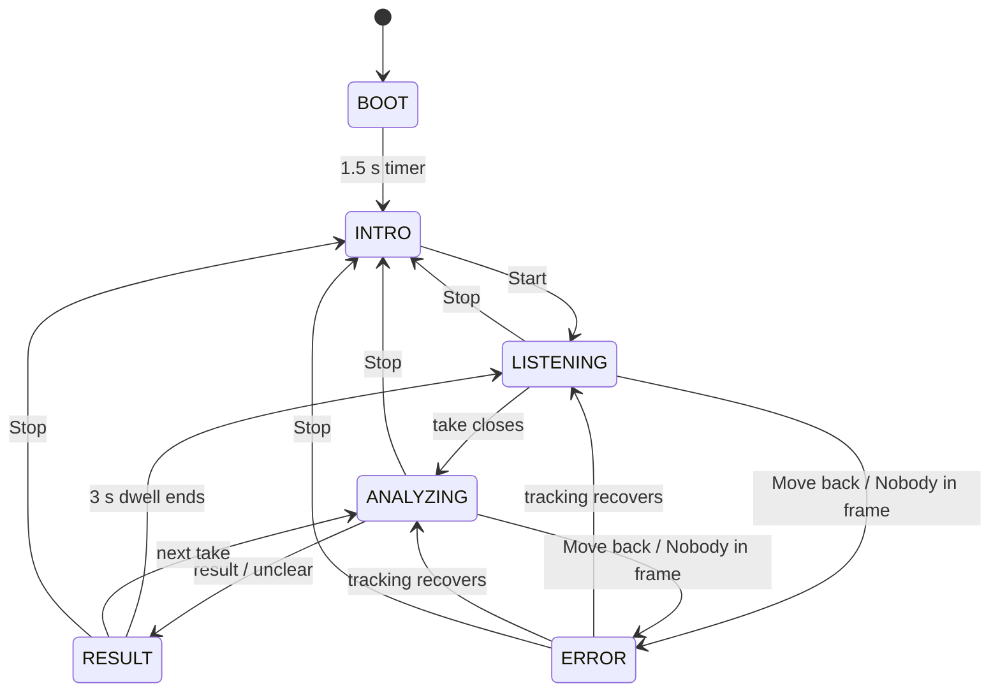

# The panel

The CrowPanel 2.8" ESP32 display: what it renders, how to build and flash it,
and how to exercise the UART link without the rest of the stack running.

The firmware lives in [`panel/`](../panel/) — a PlatformIO project, not an
Arduino sketch. Two STM32 sketches can drive it, and **only one can be flashed
at a time**:

| Sketch | Role |
| :--- | :--- |
| [`applab/signally-console/sketch/`](../applab/signally-console/sketch/) | The real path. Moves lines between the App Lab Bridge and the UART. No state machine, no `seq`. Flashed by App Lab when the console app starts |
| [`mcu/uno_q_mcu_uart_test/`](../mcu/uno_q_mcu_uart_test/) | Bench harness. Mock state machine driven by typed commands, for testing the panel with no Linux stack running |

---

## 1. Where it sits

```
orchestrator (Linux, :9977)
     |  GET /events (SSE)                POST /uplink
     v                                        ^
signally-console (App Lab container)          |
     |  Bridge.notify("display_line")         |  Bridge.notify("panel_uplink")
     v                                        |
console sketch/ on the STM32  ────────────────┘
     |  UART 115200 8N1, D0/D1
     v
panel/  (CrowPanel ESP32)
```

Every hop is implemented and verified on hardware with the stack up, the Bridge
hop included. See section 5 for what was exercised.

**The console detects the panel rather than being told about it.** On each
reconnect it calls `panel_hello` over the Bridge. If a relay answers, the console
stops acking on the panel's behalf and becomes a mirror — the real acks come back
up through `panel_uplink`. If nothing answers, it behaves exactly as it always
did, as a stand-in. The Panel badge on the page says which mode it is in.

Two components acking one `seq` would tell the orchestrator each message landed
twice, and would keep saying so after the panel went quiet — which is the failure
this detection exists to prevent.

**The panel is a peripheral.** It is flashed once and then renders whatever
arrives; you do not need to rebuild it to run the stack. It has no network, no
filesystem dependency at runtime, and no state of its own beyond what the last
message told it.

---

## 2. Wiring

| CrowPanel | | UNO Q |
| :--- | :---: | :--- |
| GPIO16 (UART1 RX) | ← | D1 (Serial1 TX) |
| GPIO17 (UART1 TX) | → | D0 (Serial1 RX) |
| GND | — | GND |

The ground is not optional and is the first thing to check when the link is
silent. Pins are defined once in [`panel/protocol/config.h`](../panel/protocol/config.h)
and mirrored in [`mcu/uno_q_mcu_uart_test/config.h`](../mcu/uno_q_mcu_uart_test/config.h);
nothing checks that the two agree.

GPIO16/17 are otherwise unused. UART0 is the USB console and must not be
touched; UART2's default pins collide with the display bus.

---

## 3. What each message does to the screen

The panel implements the display protocol as the orchestrator emits it — see
[`orchestrator/src/orchestrator/protocol.py`](../orchestrator/src/orchestrator/protocol.py)
and the fixtures beside it. Every row below is acked.

| Message | Screen | Notes |
| :--- | :--- | :--- |
| `{"t":"state","s":"idle"}` | INTRO — "Press ▼ to Start / Stop", "Tap Start to begin" | The panel retired its own Idle screen when the controls moved to physical buttons. `idle` and `intro` are two wire names for one screen |
| `{"t":"state","s":"listening"}` | pulsing ring, "Detecting. / Sign Now" | camera icon green |
| `{"t":"state","s":"analyzing"}` | larger ring, "Translating" | camera icon green |
| `{"t":"result","id","text","conf"}` | the sentence | `id` and `conf` are logged, not shown |
| `{"t":"unclear","conf"}` | RESULT screen, "Didn't catch that. / Please sign again." | **Not the error screen.** Wording is the panel's, in `UNCLEAR_TEXT` |
| `{"t":"error","text"}` | warning triangle + the text | Shows the orchestrator's own wording — "Move back", "Nobody in frame", "Recognition offline" |
| `{"t":"status","bat","mic_muted","spk_muted"}` | battery + mute icons | **The orchestrator never sends this.** See section 5 |
| `{"t":"hello","v":1}` | — | answered with `{"t":"ack","seq":0}` |

Going the other way, from the physical buttons on the enclosure:

| Message | When |
| :--- | :--- |
| `{"t":"button","seq":N,"b":"start"}` / `"stop"` | Start/Stop button. A toggle on whether capture is on, whatever screen is up: `stop` from LISTENING, ANALYZING, RESULT or ERROR alike, and the panel goes to INTRO without waiting for `state idle`. The flag follows `state` messages too (`idle` clears it, `listening`/`analyzing` set it), so a stop from the console page does not leave the next press sending the wrong word. The panel has already moved its own screen; this is a notification |
| `{"t":"button","seq":N,"b":"mute","on":true}` | Mute button. **`on` carries the resulting state** — the orchestrator reads `bool(msg.get("on", False))`, so a press reported without it registers as an unmute every time |

The panel keeps its own `seq` counter for these, independent of the
orchestrator's. It is ignored upstream.

### Two states the orchestrator never sends

`boot` and `intro`. BOOT is a 1.5 s splash on a local timer inside
`ui_center.c`, and it advances to INTRO on its own. **Nothing upstream should
drive that transition** — the panel is already showing something before any
message arrives.

### There is no "error over"

The protocol has no message that clears an error. The orchestrator gets the
panel off the error screen by re-sending a `state` message, which is what
`_tracking()` in `core.py` does on recovery. The panel handles that already; it
just means an error screen persists until something else is sent.

### Screens, and how the panel moves between them

Six screens, from `ui_state_t` in
[`panel/include/ui_center.h`](../panel/include/ui_center.h). The panel decides
only two things itself — BOOT advancing to INTRO, and the Start/Stop button.
Every other move is a message from the orchestrator.

| Screen | Shows | Camera icon |
| :--- | :--- | :--- |
| BOOT | "SignAlly" splash | grey |
| INTRO | "SignAlly", "Press ▼ to Start / Stop", "Tap Start to begin" | grey |
| LISTENING | pulsing ring, "Detecting. / Sign Now" | green |
| ANALYZING | larger pulsing ring, "Translating" | green |
| RESULT | the sentence, or "Didn't catch that. / Please sign again." | grey |
| ERROR | warning triangle + the orchestrator's text | grey |

The speaker icon is gated to RESULT and hidden on every other screen.



A fault (flow 7) can reach ERROR from any screen and is left out of the diagram
to keep it readable.

| # | Flow | Decided by | Detail |
| :--- | :--- | :--- | :--- |
| 1 | BOOT → INTRO | panel | 1.5 s timer in `ui_center.c`. Never on the wire |
| 2 | INTRO → LISTENING (**Start**) | panel, then orchestrator | The panel moves at once and sends `button start`. The orchestrator turns capture on and confirms with `state listening`; if `POST /capture` fails it sends `error` "Recognition offline" instead |
| 3 | LISTENING → ANALYZING | orchestrator | recognition's `classifying` becomes `state analyzing` |
| 4 | ANALYZING → RESULT | orchestrator | `result` or `unclear`, then held for `RESULT_DWELL_S` (3 s) in `app.py` |
| 5 | RESULT → the next screen | orchestrator | During the dwell, `state listening` and tracking errors are queued — only the latest is kept — and shown when it ends. `state analyzing` (the signer went straight into another take), `state idle` and faults cut the dwell short |
| 6 | LISTENING / ANALYZING ↔ ERROR (tracking) | orchestrator | `clipped` → "Move back", `absent` → "Nobody in frame". Sent only while capturing. On recovery the orchestrator re-sends `state` for the screen it was on |
| 7 | any → ERROR (fault) | orchestrator | Camera lost, model error, "Recognition offline". Sent whether or not capture is on, so it can land on INTRO. "Recognition offline" clears with a `state` re-send when the stream comes back; a camera or model fault has no clearing message and stays up until the orchestrator next changes screen — a new take, or Stop |
| 8 | LISTENING / ANALYZING / RESULT / ERROR → INTRO (**Stop**) | panel, then orchestrator | The panel moves at once and sends `button stop`. The orchestrator turns capture off and sends `state idle`, which the dwell never holds |

Start/Stop toggles on whether capture is on, not on the screen — see the button
row in the uplink table above.

**What moves the screen without a press.**

- **A panel reboot.** BOOT → INTRO, then the panel's `hello` is answered with
  `hello` and a `state` for the orchestrator's current screen. A panel restarted
  mid-capture jumps straight to LISTENING or ANALYZING. Only the `state` is
  re-sent: a sentence that was on screen before the reboot does not come back.
- **Start or stop from the console page.** It arrives as a `state`, and the
  panel's capture flag follows it, so the next physical press still sends the
  right word.

**Stop shows INTRO, then snaps back.** The panel moved, but `button stop` never
reached the orchestrator, so capture is still on and its next `state` or `error`
pulls the screen away again. That is the uplink — panel GPIO17 → UNO Q D0 —
not the button. The tell is `acks.received` in `/health` standing still while
`acks.sent` climbs.

**The standalone demo.** Until the first `state`, `result`, `unclear` or `error`
since boot, a fixed-timer stub in
[`capture_stub.c`](../panel/src/capture_stub.c) runs the loop by itself:
Start → LISTENING → 3 s → ANALYZING → 1.5 s → RESULT with placeholder text. It
stays off from the first such message until the next reboot. `status` and
`hello` do not switch it off — so a panel whose `hello` goes unanswered, with no
stack running or with a dead uplink, shows a fake result when Start is pressed.

**Not screen changes.** The mute button and `status` change only the status bar.
Touch is disabled in `main.cpp`, so nothing on the glass responds.

---

## 4. Build, flash, and test the link

Two boards, two toolchains. The panel needs PlatformIO; the STM32 needs
`arduino-cli`, which ships inside App Lab.

### Ports

The panel's serial port is **specific to the machine it is plugged into, and can
change** between plugs — on some hosts even mid-session without unplugging.
`platformio.ini` deliberately pins no `upload_port`, so find the port each time
and pass it explicitly:

```bash
pio device list
```

Use the entry described as `USB-SERIAL CH340` (VID:PID `1A86:7523`). It appears
as `COMn` on Windows, `/dev/cu.usbserial-*` on macOS and `/dev/ttyUSB*` on Linux.
**Always pass it**: with the UNO Q also on USB, auto-detection picks the Arduino
and fails with "No serial data received", which looks exactly like a board that
needs BOOT held.

If `pio` is not on `PATH`, it is in PlatformIO's own virtualenv —
`~/.platformio/penv/bin/pio` on macOS and Linux,
`%USERPROFILE%\.platformio\penv\Scripts\pio.exe` on Windows.

### Panel

`<port>` is the CH340 port found above:

```bash
cd panel
pio run -e esp32dev                                   # build
pio run -e esp32dev -t upload --upload-port <port>    # flash
pio device monitor --port <port> --baud 115200        # watch
```

At boot you should see, and the absence of the first line means the link is not
open at all:

```
uart_link: UART1 up on RX=GPIO16 TX=GPIO17 @ 115200 8N1
uart_link: [UART TX] {"t":"hello","v":1,"fw":"0.1.0"}
demo_manager: LittleFS mounted. demo_state.json NOT applied -- type 'reload' to force it onto the UI.
```

### STM32

**The relay is not flashed by hand.** It lives at
`applab/signally-console/sketch/sketch.ino` because App Lab discovers a sketch
only at `<app>/sketch/sketch.ino`, and starting the console app compiles and
uploads it:

```bash
arduino-app-cli app start ~/SignAlly/applab/signally-console
```

That is the whole procedure, and `scripts/signally-start.sh start` already does
it. Watch `~/logs/console.log` for `sketch compiling and uploading`; the
libraries resolve themselves, which is why `sketch.yaml` lists none.

The **bench harness** is the one you flash yourself. Arduino requires the sketch
folder name to equal the `.ino` name, which is why it has its own directory:

```powershell
$cli = "$env:LOCALAPPDATA\AppLab\resources\arduino\arduino-cli\arduino-cli.exe"
$cfg = "$env:LOCALAPPDATA\AppLab\a15\arduino-cli.yaml"

$sketch = "mcu/uno_q_mcu_uart_test"      # bench harness

& $cli --config-file $cfg board list     # note the UNO Q's port
& $cli --config-file $cfg compile --fqbn arduino:zephyr:unoq $sketch
& $cli --config-file $cfg upload -p <unoq-port> --fqbn arduino:zephyr:unoq $sketch
```

`<unoq-port>` is the port `board list` reports for the UNO Q. Like the panel's,
it differs between machines, so look it up rather than reusing one.

Flashing one replaces the other. Pick by what you are doing:

- **Bringing up or changing the panel** -> `uno_q_mcu_uart_test`. Needs nothing
  running on the Linux side, and gives you typed commands over USB serial.
- **Running the stack** -> the console's own `sketch/`. You do not flash this by
  hand: `arduino-app-cli app start` compiles and uploads it, replacing whatever
  was on the STM32. It logs to App Lab's Monitor rather than USB serial -- so a
  relay sitting on the bench looks like a board doing nothing at all.

### The test

Open the STM32's Serial Monitor at 115200 and type commands. Every one should
produce a matching `[ACK]`:

| Type | Sends | Panel should show |
| :--- | :--- | :--- |
| `start` | `state listening`, then `analyzing` at +3 s and a `result` at +5 s | the mock run, ending on "I have pain" |
| `stop` | `state idle` | INTRO |
| `unclear` | `unclear conf=0.35` | "Didn't catch that." |
| `error` | `error text="Nobody in frame"` | warning triangle + that text |
| `bat 42` | `status bat=42` | battery 42% |
| `spk mute` / `spk unmute` | `status spk_muted=…` | speaker icon on RESULT only |
| `?` | nothing | prints current state and status bar |

The ledger is the test. Every `[UART TX] ... "seq":N` from the STM32 must be
followed by `[UART RX] {"t":"ack","seq":N}` with the same N. A gap means the
panel dropped the message — an unknown type or an unknown state name is dropped
deliberately and **not** acked, so a missing ack is a real signal, not noise.

### Reading the panel's own log

The panel prints the other half of the same exchange on its USB console, which
is the faster place to see *why* something was dropped:

```
uart_link: [UART RX] {"t":"unclear","seq":3,"conf":0.35}
uart_link: unclear conf=0.35
uart_link: [UART TX] {"t":"ack","seq":3}
```

---

## 5. What is not built, and what is not verified

- **The Bridge hop now runs.** Verified on hardware 2026-09-07, with the full
  stack up: the console's probe answered `panel relay present: relay-0.1.0`, and
  every downlink line reached the panel about 100 ms later and came back acked.
  Both halves are exercised -- `panel_send()` / `on_panel_uplink()` in the
  console, `onDisplayLine()` / `pumpUplink()` in the console's `sketch/`.

  The two worries this section used to carry are both settled:

  - **`provide_safe` is correct, and there is no reason to fall back to
    `provide`.** It binds the method behind a `"__safe__"` queue that
    `update_safe()` drains, and the Zephyr core calls that every iteration
    through the weak `__loopHook()` (`cores/arduino/main.cpp:45`). So the
    callback really does run in the main loop thread -- the same one that reads
    the UART -- and the sketch needs no explicit pump. It is strictly safer than
    the spike's `provide`, which would put two threads on one UART with no lock.
    Do not define your own `__loopHook` in this sketch: it is weak, and
    overriding it silently stops downlink.
  - **Uplink by `Bridge.notify` from the sketch is the vendor's own pattern**,
    not an improvisation -- it is what
    `core-and-foundational/03-bridge-basics/02-send-data-to-python` does, down to
    calling it from `loop()` and registering the Python side with
    `Bridge.provide` before `App.run()`.
- **`status` has no upstream source.** The panel renders battery and mute icons
  from `{"t":"status"}`, but the orchestrator has no battery reading and never
  emits the message. It does track `muted` in `DeviceState`. The panel's handler
  is harmless while dormant; either wire it up or leave it.
- **The mute button's `on` field is unverified on hardware.** The code is in
  place on both sides and compiles, but it needs a physical press on the
  enclosure button to exercise, which has not been done.
- **`demo_state.json` is a bench override, not boot state.** It is applied only
  when you type `reload` on the panel's USB console. This matters because a
  panel that seeded its status bar from that file at boot looked alive when the
  UART link was dead — the exact failure that hid a stale flash for a day.
- **The panel's parser is a substring scan, not a JSON reader.** No escape
  handling: a `"` or `\` in `text` truncates it. All 17 rows in `phrases.json`
  are plain ASCII today, so this does not bite yet. `protocol.py`'s 256-byte
  line cap matches `UART_BUFFER_SIZE` on the panel exactly.
